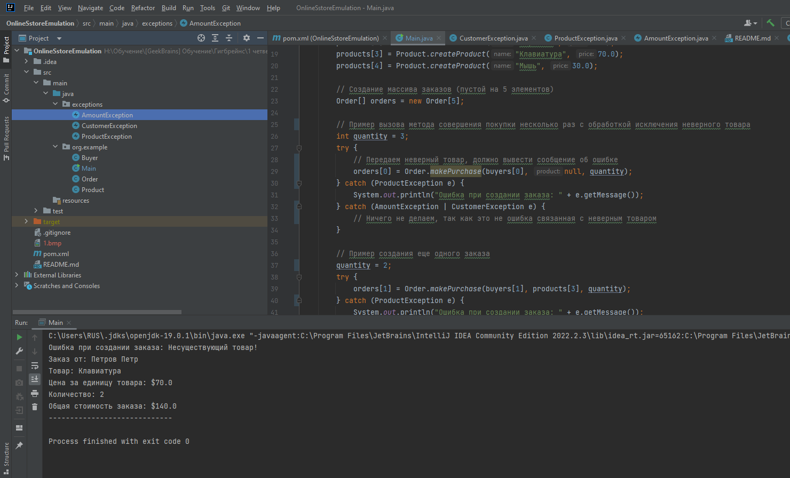

# OnlineSstoreEmulation

# Java Core (семинары)
## Урок 4. Обработка исключений
### Класс «Эмуляция интернет-магазина».
1. Написать классы покупатель (ФИО, возраст, телефон), товар (название, цена) и заказ (объект покупатель, объект товар, целочисленное количество).
2. Создать массив покупателей (инициализировать 2 элемента), массив товаров (инициализировать 5 элементов) и массив заказов (пустой на 5 элементов).
3. Создать статический метод «совершить покупку» со строковыми параметрами, соответствующими полям объекта заказа. Метод должен вернуть объект заказа.
4. Если в метод передан несуществующий покупатель – метод должен выбросить исключение CustomerException, если передан несуществующий товар, метод олжен выбросить исключение ProductException, если было передано отрицательное или слишком больше значение количества (например, 100), метод должен выбросить исключение AmountException.
5. Вызвать метод совершения покупки несколько раз таким образом, чтобы заполнить массив покупок возвращаемыми значениями. Обработать исключения следующим образом (в заданном порядке):
```agsl
– если был передан неверный товар – вывести в консоль сообщение об ошибке, не совершать данную покупку;
– если было передано неверное количество – купить товар в количестве 1;
– если был передан неверный пользователь – завершить работу приложения с исключением.
```
Примеры вывода в консоль:



6. Вывести в консоль итоговое количество совершённых покупок после выполнения основного кода приложения.
